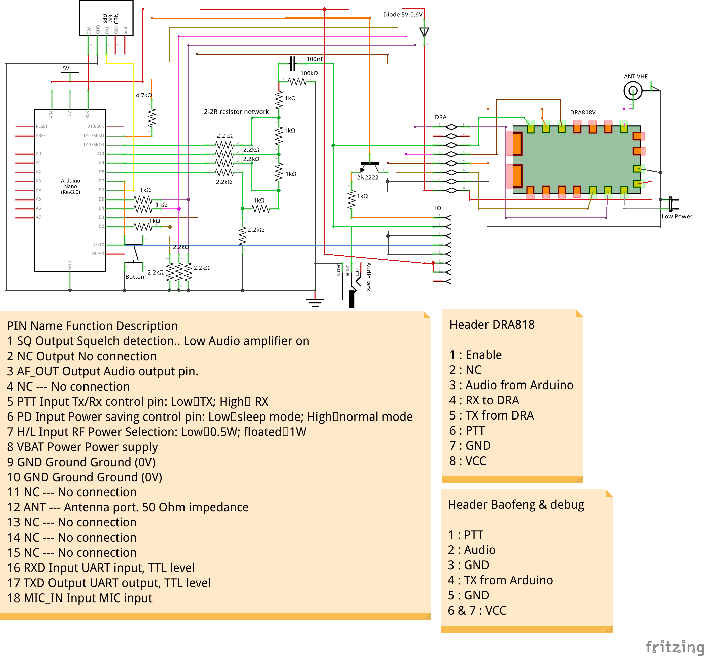
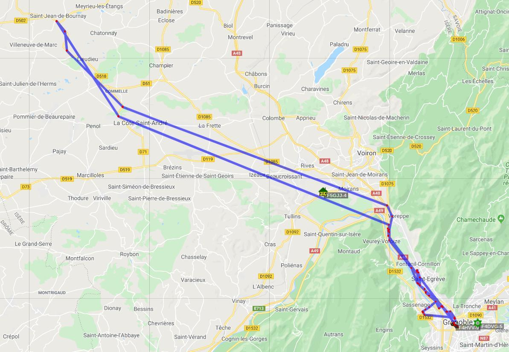

# GPS tracker on Ham radio APRS network with DRA818 module

## The projet

Inspiration : https://github.com/Toni43/MiniSmartTracker

### Hardware parts used
- Arduino [Nano](https://store.arduino.cc/arduino-nano)
- GPS Module ([NEO 6M](https://www.amazon.fr/NEO-6M-GPS-module-puissance-GY-GPS6MV2/dp/B01ICYA4QU))
- VHF TX module ([DRA818V](http://www.dorji.com/docs/data/DRA818V.pdf))

### Software parts used
- [PlatformIO](https://platformio.org/)
- [QAPRS lib](https://bitbucket.org/valentintintin/arduinoqaprs/) from Lukasz SQ5RWU, forked by me to add PWM
- [TinyGPS+ lib](http://arduiniana.org/libraries/tinygpsplus/)
- [DRA818 lib](https://github.com/fatpat/arduino-dra818) from Jereme Loyet
- [EasyButton](https://github.com/evert-arias/EasyButton) from Evert Arias 

### The circuit

### The Arduino program

The project has one main function : **send its GPS coordinate on ham radio APRS network**.
To accomplish that it has 3 ways :
- With the DRA818V module
- With a Baofeng UV5-R/UVB5 etc connected to the board
- With an external TX by the jack connector

### Compile and run

I use PlatformIO insted of the Arduino IDE.

1. Install [PlatformIO](https://docs.platformio.org/en/latest/installation.html)
2. Run `git clone https://github.com/valentintintin/arduino-tracker-aprs-dra818.git && cd arduino-tracker-aprs-dra818`
3. You have to uncomment `APRS_HW_TYPE_R2R` or `APRS_HW_TYPE_PWM` and comment all the others in `.piolibdeps/ArduinoQAPRS/ArduinoQAPRS.h`
4. Plug your Arduino nano
5. Run `pio run --target upload -e nanoprod`

##### Notes

- There are 2 environments : `nanoprod` without any logs, `nanotest` or with log and APRS sended every time even if no GPS locked.
- The QAPRS lib use a **R2R resistor network** to generate the sound signal or **PWM if you change the circuit and small part of code**. 
- There are many board for DRA818  ([by Handiko](https://github.com/handiko/Dorji-TX-Shield), [by SV1AFN](https://www.sv1afn.com/dra818.html), [by HamShop.cz](https://www.hamshop.cz/avr-arduino-raspberry-pi-c16/vhf-transceiver-module-134174mhz-1w-dra818v-i266/)).
- In boards, Low Pass filter is not always included, **it's recommended to add one**
- To debug I use the button and the TX pin from Arduino with a [M5 Stack](https://m5stack.com/) with my [Logger Project](https://github.com/valentintintin/m5-serial-logger)

#### Program flow

1. At the startup, the Arduino try to detect if there is a DRA818 module plugged. If the connexion failed, it goes to the Baofeng mode.
    - *The sound (AFSK) is always present on the jack connector and on Baofeng header pins. We don't have to use multiple options at the same time because sound "intensity" will decrease.*
    - If you want to start in *test mode* (no guard for GPS fix or TX rate), keep pressed the button at startup
2. If the GPS is locked AND time between TX is reached ==> send the new location. The time between TX is defined by the speed and two affine functions.
3. Keep pressed the button to send your position (if GPS fix) manually

### Photos

| | | | |
|:-------------------------:|:-------------------------:|:-------------------------:|:-------------------------:|
|  |  ||

### Test

I did a real test of my project (65 Km * 2 round-trip). I bought an antenna VHF/UHF [Sirio 2070H](https://www.crtfrance.com/fr/systeme-pl/126-hp-2070-h-sirio-mobiles-antenne-mobile.html).

Results from [aprs.fi](https://aprs.fi/) are surprising ! With only 1 Watt, [F5ZFL-4](https://aprs.fi/info/a/F5ZFL-4) at 81Km of my position received one frame !

## The author

My name is Valentin and my callsign is F4HVV.
I'm not good in electronics but I can do such project working approximately :)
